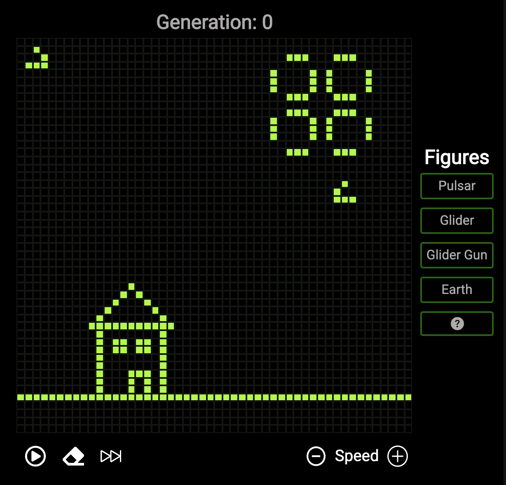
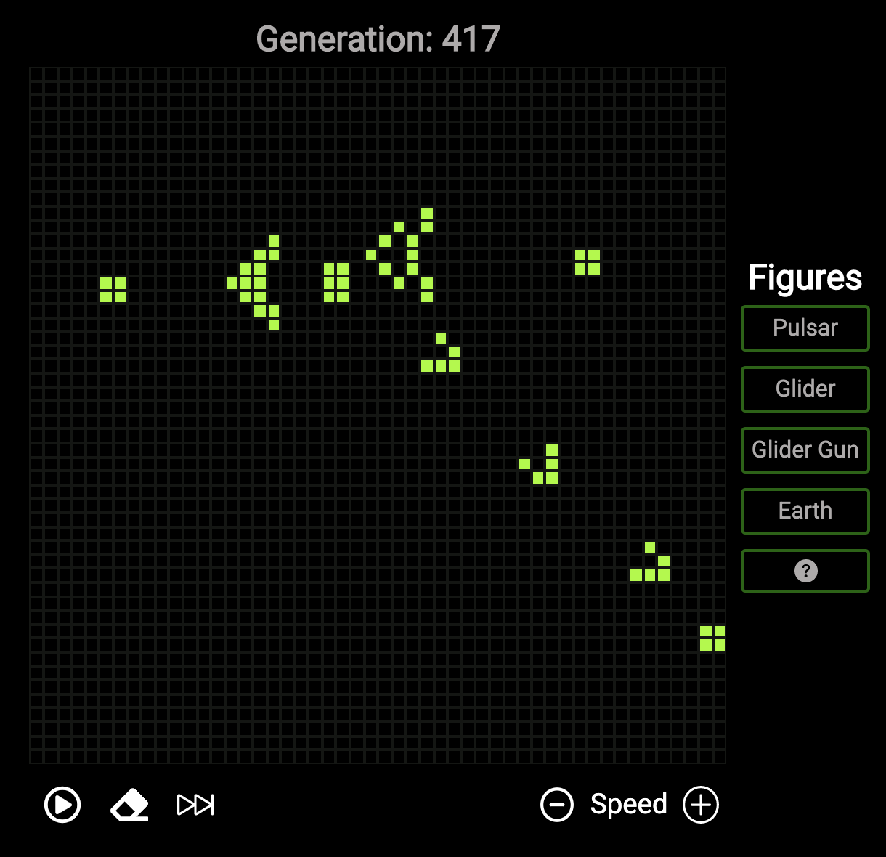

# Game of Life

A very famous cellular automaton is John Conway's Game of Life. The game is a class of discrete model known as a cellular automaton, see my rendition [here](https://game-of-life-black.vercel.app/).

## Motivation

John Conway's Game of Life is renowned in the realm of computer science and mathematics. his game that visually demonstrates an algorithm known as _cellular automaton_ that simulates "life" on a 2D grid. It has been recreated many times for theoretical interest and as a practical exercise in programming and data display. It was my turn.

## Screenshots

#### Earth Configuration



#### Glider Gun Configuration



## Features

-   Preconfigured grids
    -   Earth
    -   Pulsar
    -   Glider
    -   Glider gun
    -   Random
-   Generation counter
-   Generation increment control
-   Start and stop controls
-   Speed controls
-   Ability to create your own grid configuration

## How To

1.  Select or create a new grid configuration.
2.  Press play or step through each generation, one at a time.
3.  Clear the grid and start again!

## Code Example

#### Grid Generator

```js
// Takes in a world and returns a new world based on the rules of life
export const worldBuffer = (world) => {
    let newWorld = generateWorld();
    for (let i = 0; i < GRID_SIZE; i++) {
        for (let j = 0; j < GRID_SIZE; j++) {
            let neighbors = getNeighbors(i, j, world);
            // Determine which cells live and die
            newWorld[i][j] =
                neighbors === 3 || (neighbors === 2 && world[i][j] === 1)
                    ? 1
                    : 0;
        }
    }
    return newWorld;
};
```
